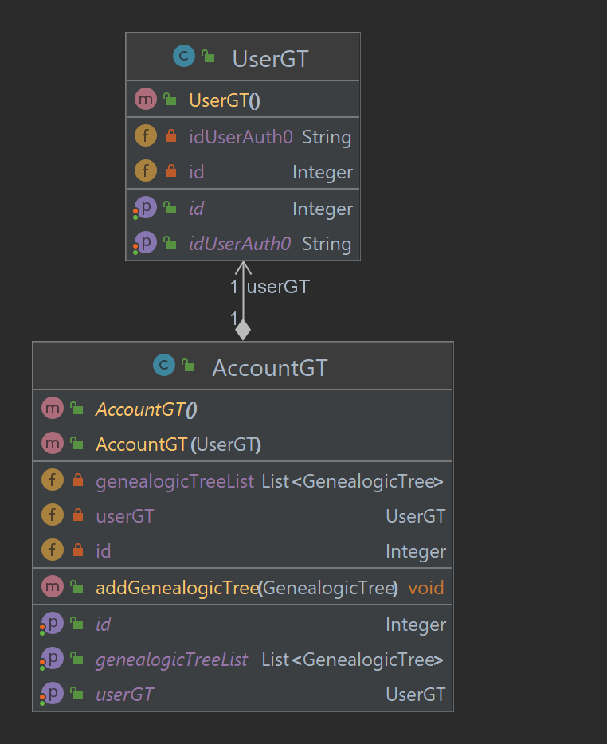
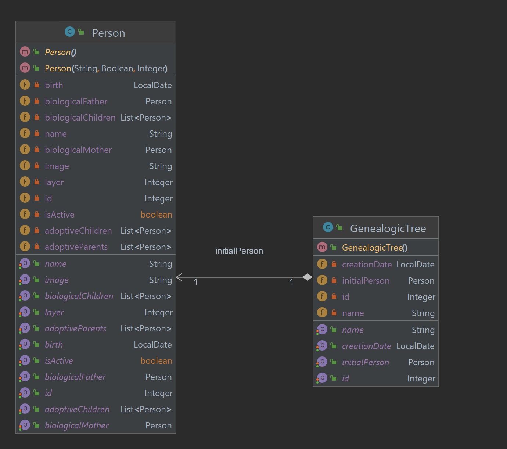

# Genealogic-Tree-Backend

### Esse projeto visa implementar um sistema capaz de criar árvores genealógicas de qualquer contexto. Contudo o desenvolvimento foi realizado levando em consideração o contexto mais abrangente de famílias, ou seja, um contexto no qual uma pessoa pode conter um pai e/ou uma mãe biológica, pode conter uma lista de pais adotivos, pode conter uma lista de filhos biológicos e pode conter uma lista de filhos adotivos.

### Ademais, o monitoramento do sistema está sendo realizado através da plataforma Splunk Enterprise a partir dos logs gerados na aplicação.

